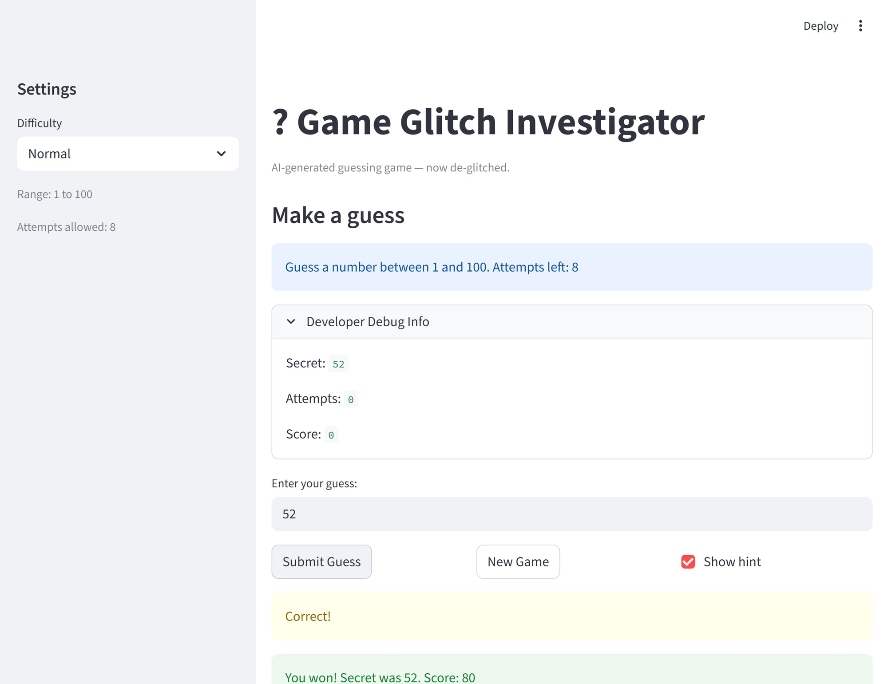

# 🎮 Game Glitch Investigator: The Impossible Guesser

## 🚨 The Situation

You asked an AI to build a simple "Number Guessing Game" using Streamlit.
It wrote the code, ran away, and now the game is unplayable.

- You can't win.
- The hints lie to you.
- The secret number seems to have commitment issues.

## 🛠️ Setup

1. Install dependencies: `pip install -r requirements.txt`
2. Run the fixed app: `python -m streamlit run app.py`

## 🕵️‍♂️ Your Mission

1. **Play the game.** Open the "Developer Debug Info" tab in the app to see the secret number. Try to win.
2. **Find the State Bug.** Why does the secret number change every time you click "Submit"? Ask ChatGPT: *"How do I keep a variable from resetting in Streamlit when I click a button?"*
3. **Fix the Logic.** The hints ("Higher/Lower") are wrong. Fix them.
4. **Refactor & Test.** Move the logic into `logic_utils.py`.
   - Run `pytest` in your terminal.
   - Keep fixing until all tests pass!

## 📝 Document Your Experience

### Game Purpose

- [x] This is a number guessing game built with Streamlit. The player selects a difficulty level (Easy, Normal, or Hard), which sets the secret number range and attempt limit. Each round, the player guesses a number and receives hints ("Go Higher" / "Go Lower") until they guess correctly or run out of attempts. The score increases on correct guesses and decreases on wrong ones.

### Bugs Found

- [x] **Bug 1 (Logic):** Hard difficulty range was `(1, 50)` — easier than Normal `(1, 100)`. Hard should be harder, not easier.
- [x] **Bug 2 (Logic):** Hint messages were reversed — the game said "Go HIGHER" when the guess was too high, and "Go LOWER" when too low.
- [x] **Bug 3 (Runtime):** On even-numbered attempts, the secret number was cast to `str`, causing string comparison instead of integer comparison. This made hints randomly wrong every other guess with no error message.
- [x] **Bug 4 (Logic):** Wrong guesses on even attempts gave `+5` points instead of `-5`, rewarding failure.
- [x] **Bug 5 (Logic):** `attempts` counter was initialized to `1` instead of `0`, making the first guess count as the second.
- [x] **Bug 6 (Logic):** The "New Game" button always restarted with range `1–100`, ignoring the selected difficulty.
- [x] **Bug 7 (Logic):** The info text hardcoded `"between 1 and 100"` regardless of the chosen difficulty.
- [x] **Bug 8 (Test):** Tests expected a string return value from `check_guess`, but the fixed function correctly returns a tuple `(outcome, message)`.

### Fixes Applied

- [x] **Fix 1:** Corrected Hard difficulty range to `(1, 200)` so it is genuinely harder.
- [x] **Fix 2:** Reversed the hint comparison logic so "Go Higher" and "Go Lower" are correct.
- [x] **Fix 3:** Removed the `str()` cast on even attempts — `secret` is always passed as an integer to `check_guess`.
- [x] **Fix 4:** Removed the even/odd score trick — wrong guesses always subtract points consistently.
- [x] **Fix 5:** Changed `attempts` initialization from `1` to `0`.
- [x] **Fix 6:** Updated the "New Game" button to call `get_range_for_difficulty(difficulty)` so the range respects the selected mode.
- [x] **Fix 7:** Changed the info text to use an f-string: `f"Guess a number between {low} and {high}"`.
- [x] **Fix 8:** Updated tests to unpack the tuple returned by `check_guess` and assert on `outcome` and `message` separately.
- [x] **Refactor:** Extracted all game logic into `logic_utils.py` (`get_range_for_difficulty`, `parse_guess`, `check_guess`, `update_score`) and wrote 16 pytest tests covering all functions.

## 📸 Demo

> *The fixed game correctly tracks attempts, shows accurate hints, and triggers a win screen with balloons when the correct number is guessed.*

## 🚀 Stretch Features

- Difficulty selector (Easy / Normal / Hard) with different number ranges and attempt limits
- Score tracking that rewards fast, correct guesses and penalizes wrong ones
- Guess history display so players can track what they've already tried
- Developer Debug Info panel showing the secret number, attempt count, and score in real time
